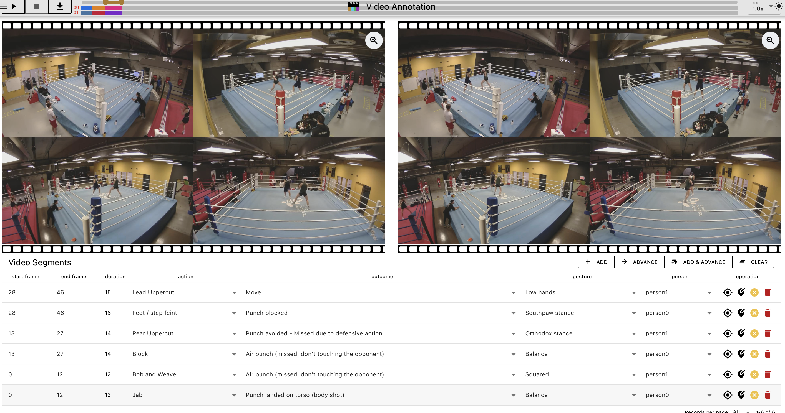
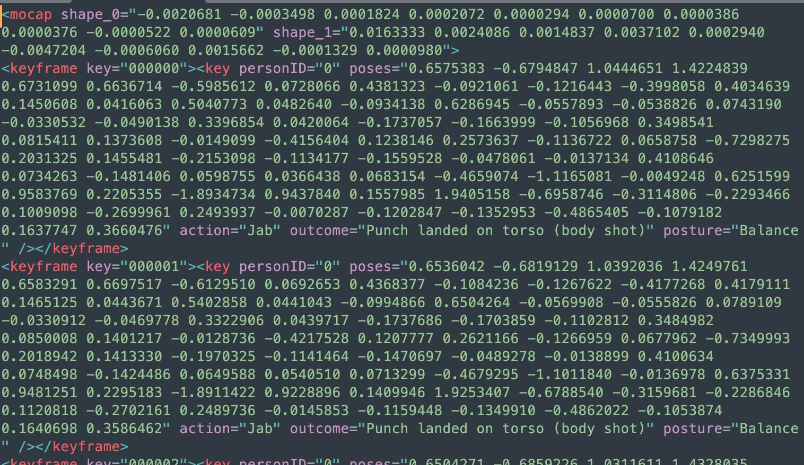

# Video Annotation

Video Annotation is an in-browser tool for labeling temporal segments in videos.
It is optimized for action/outcome/posture labeling workflows (for example, boxing action analysis), and runs as a local frontend app with no required backend.

## Tech stack

- Vue 3 + Vite
- Quasar UI framework
- Pinia state management
- Vue Router (hash history)
- WebCodecs + MP4Box worker pipeline for frame extraction/caching

## Main capabilities

- Open a local video file in the browser
- Create and edit frame-range segments
- Label each segment with action, outcome, posture, and person
- Save/load annotation JSON
- Save/load configuration JSON for labels
- Optional submit to a remote endpoint using `submiturl` query parameter
- Optional conversion of saved annotations to SMPL XML/CSV via Python scripts

## Project structure

```text
video_annotation-main/
	src/
		main.js                     # app bootstrap (Vue, Quasar, Pinia, Router)
		App.vue                     # app shell, URL query parameter handling
		components/                 # layout, drawer, top-level reusable UI
			Layout.vue
			Drawer.vue
			DrawerVideoControl.vue
			DrawerAnnotationControl.vue
			VideoLoaderV2.vue
		pages/
			annotation/               # annotation workspace (timeline/canvases/table)
			configuration/            # label schema editor
			preference/               # runtime settings
			help/                     # built-in usage and shortcuts
			notfound/
		hooks/                      # feature logic hooks
			video.js                  # open/close/reset video workflow
			annotation.js             # save/load/submit annotation workflow
		libs/
			annotationlib.js          # annotation domain classes
			utils.js                  # dialogs, notifications, file helpers, conversions
		store/                      # Pinia stores
			index.js                  # main UI state
			annotation.js             # video + annotation state
			configuration.js          # label configuration state
			preference.js             # persisted user preferences
			validation.js             # config validation helpers
		worker/
			video-process-worker.js   # MP4 probing, decode, and frame caching

	public/img/                   # static logos/assets
	bboxes/                       # dataset-related bounding-box resources
	annotation.json               # sample annotation output
	smpl.xml                      # sample SMPL input
	smpl_annot.xml                # sample converted XML output
	smpl_annot.csv                # sample converted CSV output
	write_annotation_smpl.py      # annotation -> SMPL XML/CSV converter
	write_annotation_smpl_t.py    # alternative action mapping converter
	vite.config.js
	package.json
```

## Getting started

### Prerequisites

- Node.js (current LTS recommended)
- npm

### Install

```bash
npm install
```

### Run in development

```bash
npm run dev
```

### Build for production

```bash
npm run build
```

### Preview production build

```bash
npm run preview
```

## Annotation workflow

1. Open a video from the drawer (`Open`).
2. Use the timeline/frame controls to choose a start and end frame.
3. Add a segment from the `Video Segments` table.
4. Assign action, outcome, posture, and person labels.
5. Use `advance` or `add & advance` for faster iterative labeling.
6. Save annotations to JSON.

The Help page in the app includes keyboard shortcuts and labeling guidance.

## Saved annotation format

Current save flow writes the app version and annotation payload. The annotation payload currently includes:

- `video` metadata
- `skillAnnotationList` (temporal segments and labels)

Example shape:

```json
{
	"version": "0.1",
	"annotation": {
		"video": {
			"src": "...",
			"fps": 29.99,
			"frames": 6137,
			"duration": 204.567,
			"height": 1440,
			"width": 1440
		},
		"skillAnnotationList": [
			{
				"start": 0,
				"end": 151,
				"person": 0,
				"action": 5,
				"outcome": 5,
				"posture": 0
			}
		]
	}
}
```

## Runtime URL parameters

Query keys are processed case-insensitively in `App.vue`.

Supported keys include:

- `annotation`: path/URL to annotation JSON to auto-load
- `video`: path/URL to video to auto-load
- `config`: path/URL to config JSON to auto-load
- `mode`: initial mode (`object`, `region`, `skeleton`)
- `zoom`: `true` or `false`
- `submiturl`: endpoint for submit action
- `defaultfps`, `defaultfpk`, `decoder`
- `showobjects`, `showregions`, `showskeletons`, `showactions`
- `muted`, `grayscale`, `showpopup`

Example:

```text
http://localhost:5173/#/?video=./sample.mp4&submiturl=http://localhost:8000/submit&defaultfps=10
```

## Python conversion scripts (optional)

Use these scripts to combine annotation segments with SMPL pose data and output XML or CSV.

### Python requirements

```bash
pip install numpy absl-py
```

### Generate XML

```bash
python write_annotation_smpl.py --xml_smpl smpl.xml --annotation_file annotation.json
```

### Generate CSV

```bash
python write_annotation_smpl.py --xml_smpl smpl.xml --annotation_file annotation.json --csv
```

`write_annotation_smpl_t.py` provides an alternative action mapping profile and supports the same flags.

## Screenshots


